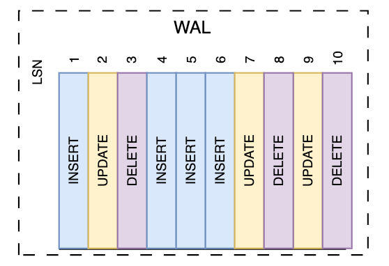
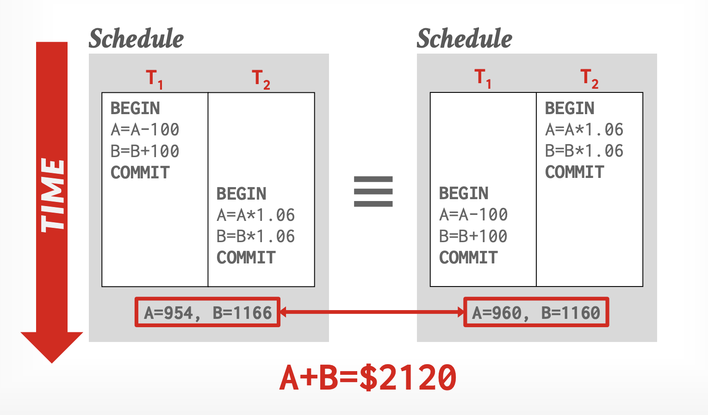
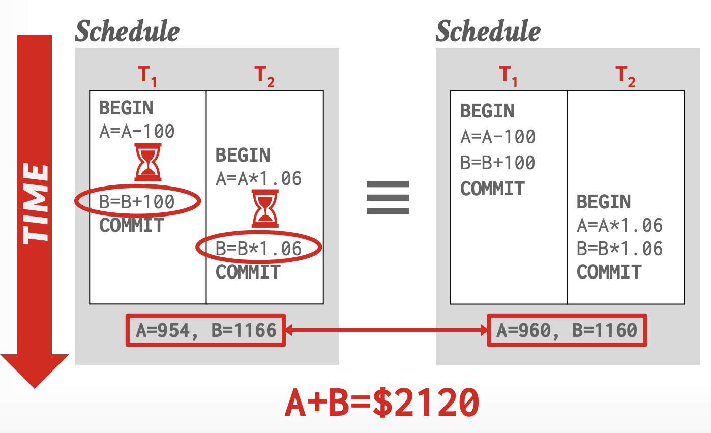
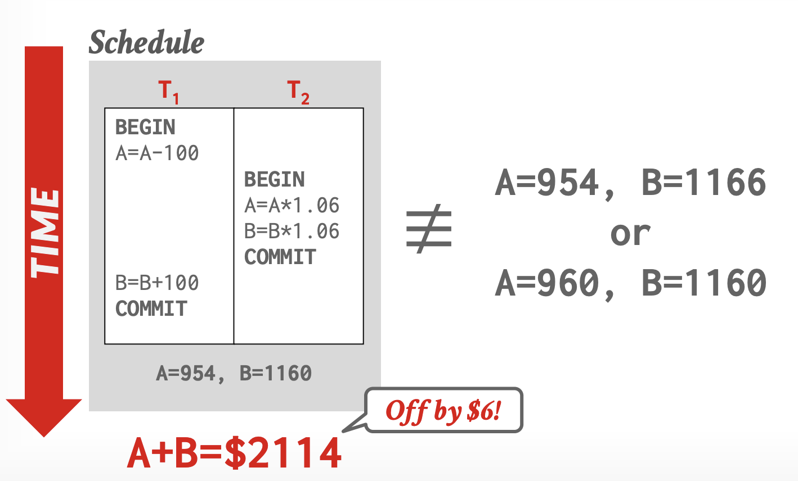

# Module 1 - Transactions and Concurrency Control

### Using Movie Seat Booking Application (PostgreSQL)

**Goal:** Build a complete, intuitive mental model of transactions, ACID, isolation, MVCC, locks, anomalies, deadlocks and safe application patterns.

## 1. Introduction

This module teaches the fundamentals of transactions and concurrency control using a simple and relatable example: a **movie seat booking system**.

PostgreSQL is used for all examples.

The goal is to help beginners understand:

* What can go wrong in multi-user systems
* Why transactions exist
* How PostgreSQL manages them
* How isolation and locking work
* How to avoid errors such as double booking
* How PostgreSQL handles concurrency internally

## 2. The System: Movie Seat Booking

Imagine we have a simple system:

```plaintext

User chooses a seat → System checks availability → System books seat → Payment happens

```

Many people may book seats at the same time.

We store seats like this:

```sql

CREATE DATABASE movie;

\c movie;

CREATE TABLE shows(
  id SERIAL PRIMARY KEY,
  code TEXT UNIQUE
);

CREATE TABLE seats(
  id SERIAL PRIMARY KEY,
  show_id INT REFERENCES shows(id),
  seat_no TEXT,
  house BOOLEAN DEFAULT FALSE,      -- house seat (kept aside)
  reserved BOOLEAN NOT NULL DEFAULT FALSE,
  UNIQUE(show_id, seat_no)
);

CREATE TABLE show_stats(
  show_id INT PRIMARY KEY REFERENCES shows(id),
  free_count INT CHECK (free_count >= 0),
  version INT DEFAULT 0
);

```

**Initial data:**

```sql

INSERT INTO shows(code) VALUES ('S1'); 

INSERT INTO seats(show_id, seat_no, house)
SELECT 1,'A1',TRUE UNION ALL
SELECT 1,'A2',TRUE UNION ALL
SELECT 1,'A3',FALSE UNION ALL
SELECT 1,'A4',FALSE;

INSERT INTO show_stats(show_id, free_count)
SELECT 1, COUNT(*) FROM seats WHERE show_id=1 AND reserved=FALSE;

-- shows
SELECT * FROM shows;

-- seats
SELECT * FROM seats;

-- free seat stats
SELECT * FROM show_stats;

```

## 3. What Can Go Wrong Without Transactions? (Concrete Failures)

* **Double booking**:

  * Two users see seat A1 as available and both try to book it.
* **Partial failure**:

  * Seat marked as booked → payment fails → booking record still added.
  * Seat becomes blocked with no real booking.
* **Lost update**:

  * Two processes update same data and one update disappears (Total available seats).
* **Inconsistent reads**:

  * A user sees “Seat available” but it gets booked a moment later.
* **Vacuum / bloat problem**:

  * Long open transactions prevent cleanup, slowing the DB.

Seeing these problems motivates the need for transactions, isolation, and proper patterns.

## 4. What Is a Transaction?

A transaction is a *sequence of SQL operations executed as a single logical unit*.

The database guarantees either:

* All operations in the transaction are applied (commit), or
* None of them are applied (rollback).

Transactions provide a predictable way to group steps that must succeed together.

**Visual:**

```sql

[ BEGIN ]
   check seat
   lock seat
   set seat booked
   insert booking
   charge payment
[ COMMIT ]  -> all saved

If any step fails -> ROLLBACK -> nothing saved

```

In PostgreSQL:

* If you don’t start a transaction, each statement runs as a transaction
* If you start a transaction, everything between BEGIN and COMMIT is one unit

## 5. How PostgreSQL Executes Transactions

PostgreSQL uses **autocommit** by default.

### 5.1 Autocommit Mode

Every SQL command is its own transaction:

```sql

UPDATE seats SET reserved = true WHERE show_id = 1 AND seat_no = 'A3';

```

This automatically starts and commits a transaction.

### 5.2 Explicit Transaction Block

```sql

BEGIN;

UPDATE seats SET reserved = true WHERE show_id = 1 AND seat_no = 'A3';
UPDATE show_stats SET free_count = free_count - 1 WHERE show_id = 1;

COMMIT;

```

Use explicit transactions when several steps must succeed together.

**Reset**

```sql

BEGIN;

-- Unreserve A3
UPDATE seats SET reserved = FALSE WHERE show_id = 1 AND seat_no = 'A3';

-- Cleanup stats
TRUNCATE show_stats;

-- Update the new stats
INSERT INTO show_stats (show_id, free_count)
SELECT 1, COUNT(*) FROM seats WHERE show_id = 1 AND reserved = FALSE;

COMMIT;

```

## 6. ACID Properties

* **Atomicity**: the booking and the payment both succeed, or both are undone.
  * *If payment fails, the seat should not remain booked.*
* **Consistency**: database rules (constraints, invariants) hold after the transaction.
  * *A seat cannot be both booked and unbooked.*
  * *reserved is boolean and show_stats free_count must match actual free seats.*
  * *The number of available seats cannot become negative.*
* **Isolation**: concurrent transactions do not interfere in unexpected ways.
  * *Two users booking A1 at the same time should not both succeed.*
* **Durability**: once a transaction commits, its effects persist even after crashes.
  * *Once a booking is committed, it will stay even after crashes or restarts.*
  * *PostgreSQL uses WAL (Write-Ahead Log) to ensure this.*

We will unpack isolation and durability more below.

### 6.1 Atomicity Example

Atomicity ensures that all operations in a transaction succeed together or fail together. If any part fails, the entire transaction is rolled back.

**Example: Booking a seat with payment simulation**

Assume we have a simple payment check (simulated by a condition). If payment fails, the seat reservation should be undone.

```sql

BEGIN;

-- Reserve the seat
UPDATE seats SET reserved = TRUE WHERE show_id = 1 AND seat_no = 'A3';

-- Update free count
UPDATE show_stats SET free_count = free_count - 1 WHERE show_id = 1;

-- Simulate payment: assume payment succeeds if free_count > 0 (simple check)
-- In real code, this would be an external call, but here we simulate failure
DO $$
BEGIN
    -- Simulate payment failure (e.g., insufficient funds)
    RAISE EXCEPTION 'Payment failed';
END $$;

COMMIT;  -- This will not execute; transaction rolls back

```

Since payment fails, the transaction rolls back, and the seat remains unreserved, free_count unchanged.

> How to handle external failure scenarios (eg: payment failure)?

**Check after rollback:**

```sql

SELECT reserved FROM seats WHERE show_id = 1 AND seat_no = 'A3';  -- FALSE
SELECT free_count FROM show_stats WHERE show_id = 1;  -- 2

```

### Mechanisms for Ensuring Atomicity

There are two approaches: Logging and Shadow Paging.

#### Approach 1: Logging:

* DBMS records all actions in an ordered ledger so that it can reverse (undo) actions of aborted transactions
* Log records are maintained both in memory and on disk
* Replay(redo) log after crash to put database back in correct state

**Visual:**

```plaintext

Transaction          Log File         Data File (Disk)

   |                    |                      |

   |-- 1. Update X --+                      |

   |                    |-> Record: "X=New"    |

   |                    |   (Saved to Disk)    |

   |                    |                      |

   |-- 2. Commit -+                      |

   |                    |-> Record: "Commit"   |

   |                    |   (Saved to Disk)    |

   |                    |                      |

   |                    |                      |> 3. Async Write (Checkpoint)

   |                    |                      |    (X=New written to data file)

   |                    |                      |


   *CRASH* before step 3? -> Replay WAL to restore X=New

```

Example: **Write Ahead Logging (WAL)**



Most database systems follows this approach:: MySQl< PostgreSQL, MSSQL, etc.

#### Approach 2: Shadow Pagging

* DBMS makes copies of changes
* Transactions make changes to those copies
* Make modified pages visible to other transactions only when the transactions successfully commits
* Instance recovery after crash

### 6.2 Consistency Example

Consistency ensures that the database remains in a valid state after the transaction, adhering to constraints and invariants.

**Example: Ensuring free_count matches actual free seats and cannot go negative**

The invariant is that `free_count` should equal the count of unreserved, non-house seats and never be negative (enforced by `CHECK` integrity constraint).

```sql

BEGIN;

-- Reserve a seat
UPDATE seats SET reserved = TRUE WHERE show_id = 1 AND seat_no = 'A3';

-- Update free_count correctly
UPDATE show_stats SET free_count = free_count - 1 WHERE show_id = 1;

-- If we tried to set free_count to -1, it would violate the CHECK constraint
-- UPDATE show_stats SET free_count = -1 WHERE show_id = 1;  -- This would fail with constraint violation

COMMIT;


```

After commit:

```sql

SELECT COUNT(*) FROM seats WHERE show_id = 1 AND reserved = FALSE AND house = FALSE;  -- 1 (A4)
SELECT free_count FROM show_stats WHERE show_id = 1;  -- 1

```

The `CHECK` constraint prevents free_count from becoming negative, enforcing consistency.

Example:

```sql

UPDATE show_stats SET free_count = -1 WHERE show_id = 1;  -- This would fail with constraint violation

```

Contraints violation:

```sql

ERROR:  new row for relation "show_stats" violates check constraint "show_stats_free_count_check"
DETAIL:  Failing row contains (1, -1, 0).

```

### 6.3 Isolation Example

Isolation ensures that concurrent transactions do not interfere. Two users booking the same seat should not both succeed.

**Example: Concurrent booking attempt**

User 1:

```sql

BEGIN;

SELECT reserved FROM seats WHERE show_id = 1 AND seat_no = 'A3' FOR UPDATE;  -- Locks the row

UPDATE seats SET reserved = TRUE WHERE show_id = 1 AND seat_no = 'A3';

UPDATE show_stats SET free_count = free_count - 1 WHERE show_id = 1;

COMMIT;

```

User 2 (Simultaneously):

```sql

BEGIN;

SELECT reserved FROM seats WHERE show_id = 1 AND seat_no = 'A3' FOR UPDATE;  -- Waits for User 1's lock

-- After User 1 commits, this will see reserved = TRUE, so no update
UPDATE seats SET reserved = TRUE WHERE show_id = 1 AND seat_no = 'A3' AND reserved = FALSE;  -- No rows updated

COMMIT;

```

Only one booking succeeds.

## Understanding Anamolies

While it's easier for application developers to assume transactions run one at a time (serially), databases allow interleaving to take advantage of parallel hardware (CPUs) and improve performance (hide latency - slower disk IO).

Here's an example to build intuition:

Imagine two transactions, T1 and T2, running simultaneously:

* **T1:** Wants to transfer $100 from Account A to Account B.
  * Operation 1: Read balance of Account A
  * Operation 2: Deduct $100 from Account A
  * Operation 3: Read balance of Account B
  * Operation 4: Add $100 to Account B
  * Operation 5: Commit T1
* **T2:** Wants to calculate 5% interest on Account A and update its balance.
  * Operation A: Read balance of Account A
  * Operation B: Calculate 5% interest
  * Operation C: Update balance of Account A
  * Operation D: Commit T2

A **serial execution** would be either T1 completely finishes, then T2 starts, OR T2 completely finishes, then T1 starts.

An **interleaved execution** mixes their operations, like this:

1. **T1: Read A** (reads $1000 from Account A)
2. **T1: Deduct $100 from A** (Account A now $900 in T1's view)
3. **T2: Read A** (reads $900 from Account A) - *This is where the problem can occur!*
4. **T2: Calculate 5% interest** (5% of $900 = $45)
5. **T2: Update A** (Account A updated to $945)
6. **T2: Commit**
7. **T1: Read B**
8. **T1: Add $100 to B**
9. **T1: Commit**

In this interleaved example, T2 read an intermediate (uncommitted) value of A ($900) that T1 had just modified. This could lead to an incorrect final state for Account A ($945 instead of $950 if T1 had finished first, or $1050 if T2 had finished first on the original $1000). These are generally refered as anamolies or conflicts.

> *We need to find a way to interleave transaction but still make it appear as if they ran one-at-a-time.*

## Mechanisms for Ensuring Isolation

A **concurrency control** protocol is how DBMS decides the proper interleaving of operations from multiple transactions.

Two categories of protocols:

* **Pessimistic:** Do not let problems arise in the first place
* **Optimistic:** Assume conflicts are rare; deal with them after they happen

### Schedule

#### The Scenario

You have two bank accounts: Account A and Account B, each starting with $1,000. Total money = $2,000.

* **Transaction T1 (Transfer $100):**
  * Reads A (gets $1,000)
  * Calculates new A (A - $100 = $900)
  * Writes A (updates A to $900)
  * Reads B (gets $1,000)
  * Calculates new B (B + $100 = $1,100)
  * Writes B (updates B to $1,100)
* **Transaction T2 (Add 6% Interest):**
  * Reads A
  * Calculates new A (A * 1.06)
  * Writes A
  * Reads B
  * Calculates new B (B * 1.06)
  * Writes B

The correct final total for A + B should be **$2,120** (after T1 and T2, if handled correctly).

#### What is a Schedule?

(Simpler) A schedule is the actual order in which the individual operations of T1 and T2 are executed by the database.

A schedule is a sequence of all operations (reads and writes) performed by a set of concurrent transactions (T1, T2, ..., Tn), maintaining the internal order of operations within each individual transaction.

#### Example of a Serial Execution:



#### Example of Interleaving Execution:

| Interleaving Good Example                                               | Interleaving Bad Examp                                                  |
| -- | -- |
|  |  |

> *How do we judge whether a schedule is correct?*

**If the schedule is equivalent to some serial execution.**

Interleaving operations can improve performance but, if not managed carefully by the database's concurrency control, can lead to incorrect or inconsistent states. The goal is to find schedules that are serializable (meaning they always produce a correct result, even if they run concurrently).

#### Properties of Schedule:

##### Serial Schedule

* A schedule that does not interleave the actions of different transactions.

##### Equivalent Schedule

* The effect of executing the first schedule is identical to the effective executing second schedule

##### Serializable Schedule

* Equivalent to some serial execution of the transaction
* If a schedule is serializable, its execution will always leave the database in a consistent state, just as if transactions had run sequentially.

### 6.4 Durability Example

Durability ensures committed changes survive crashes. PostgreSQL uses WAL to write changes to disk before commit.

**Example: After commit, even if DB crashes, the reservation persists**

```sql

BEGIN;

UPDATE seats SET reserved = TRUE WHERE show_id = 1 AND seat_no = 'A3';

UPDATE show_stats SET free_count = free_count - 1 WHERE show_id = 1;

COMMIT;  -- WAL ensures this is durable

```

If the server crashes after commit, upon restart, the changes are replayed from WAL.

Create crash:

```bash

sudo -u postgres pg_ctl -D /Library/PostgreSQL/18/data restart

```

**Reset**

```sql

-- Reset seats to initial state
UPDATE seats SET reserved = FALSE WHERE show_id = 1;

-- Reset show_stats
UPDATE show_stats SET free_count = (SELECT COUNT(*) FROM seats WHERE show_id = 1 AND reserved = FALSE) WHERE show_id = 1;

```

## 7. Transaction State Machine

A transaction and session can be in these simplified states:

* **Idle**: no transaction open.
* **Active**: inside a transaction (**BEGIN** executed, not yet committed/rolled back).
* **Idle in transaction**: transaction open but no active query (dangerous if left too long).
* **Failed / Aborted**: an error occurred; only **ROLLBACK** allowed.

**Visual:**

```plaintext

Idle -> BEGIN -> Active -> (COMMIT -> Idle)
                       (Error -> Aborted -> ROLLBACK -> Idle)

```

### Idle in Transaction

**Happens when you run:**

```sql

BEGIN;
-- then do nothing

```

This keeps locks open and can slow down the system.

### Aborted

An error inside a transaction makes it unusable until you run:

```sql

ROLLBACK;

```

**Why this matters**: long “idle in transaction” sessions hold locks and prevent vacuum, causing performance issues.


# 8. Basic Booking Transaction

```sql

BEGIN;

SELECT reserved
FROM seats
WHERE show_id = 1 AND seat_no = 'A3'
FOR UPDATE;

UPDATE seats
SET reserved = TRUE
WHERE show_id = 1 AND seat_no = 'A3';

UPDATE show_stats
SET free_count = free_count - 1
WHERE show_id = 1;

COMMIT;

```

**FOR UPDATE** ensures two people cannot book the same seat.


## 9. Row Locks (Why We Need FOR UPDATE)

PostgreSQL uses several lock types; the most common in day-to-day code are **row-level locks**. Table-level locks exist too but are less frequent for normal OLTP.

When a user tries to book a seat:

```sql

SELECT * FROM seats WHERE show_id = 1 AND seat_no = 'A3' FOR UPDATE;

```

This prevents two users from booking the same seat:

```plaintext

User 1 holds the lock  
User 2 waits  

```

> ***FOR UPDATE** prevents another transaction from updating the same row at the same time.*

**Types of operations that take row locks:**

* SELECT ... FOR UPDATE
* UPDATE
* DELETE

**Readers and writers:**

* Readers do not block other readers
* Readers do not block writers
* Writers block writers

This is because PostgreSQL uses MVCC (covered later).

Example Safe Locking Pattern

```sql

BEGIN;
SELECT id FROM seats WHERE show_id = 1 AND seat_no = 'A3' FOR UPDATE;
-- now we hold a lock on that row
UPDATE seats SET reserved = true WHERE show_id = 1 AND seat_no = 'A3';
UPDATE show_stats SET free_count = free_count - 1 WHERE show_id = 1;
COMMIT;

```

## 10. Deadlock

Deadlock happens when two transactions wait on each other.

Example:

```

User 1 locks A1  
User 2 locks A2  
User 1 tries to lock A2 → waits  
User 2 tries to lock A1 → waits  
Both are waiting → deadlock

```

PostgreSQL automatically resolves deadlocks by killing one transaction.

**Example:**

**Session 1:**

```sql

BEGIN;
SELECT * FROM seats WHERE seat_number = 'A1' FOR UPDATE;
-- pause here
SELECT * FROM seats WHERE seat_number = 'A2' FOR UPDATE; -- may wait

```

**Session 2:**

```sql

BEGIN;
SELECT * FROM seats WHERE seat_number = 'A2' FOR UPDATE;
-- pause here
SELECT * FROM seats WHERE seat_number = 'A1' FOR UPDATE; -- deadlock occurs

```

**One of the sessions will get **deadlock detected** and be aborted.**

**PostgreSQL Output Example:**

```sql

ERROR:  deadlock detected
DETAIL:  Process 46220 waits for ShareLock on transaction 950; blocked by process 90574.
Process 90574 waits for ShareLock on transaction 951; blocked by process 46220.
HINT:  See server log for query details.
CONTEXT:  while locking tuple (0,16) in relation "seats"

```

### How to prevent

* **Lock ordering**: always acquire locks in a consistent order (e.g., lowest seat number first).
* **Keep transactions short**: the less time locks are held, the lower the chance of deadlocks.
* Use lower isolation levels where acceptable.

## 11. MVCC (Multi-Version Concurrency Control)

MVCC lets PostgreSQL give each transaction a consistent snapshot.

**Key behavior:**

* Readers do NOT block readers
* Readers do NOT block writers
* Writers DO block writers

**Mental picture**

```

User 1 reads seat A1
User 2 updates A1 → creates a new version
User 1 continues reading old version

```

**Example (snapshot behavior)**

1. **User 1:**

```sql

BEGIN ISOLATION LEVEL REPEATABLE READ;

SELECT reserved FROM seats WHERE show_id = 1 AND seat_no = 'A3';
-- returns: false

```

2. **User 2:**

```sql

BEGIN;
UPDATE seats SET reserved = TRUE WHERE show_id = 1 AND seat_no = 'A3';
COMMIT;

```

3. **Back in User 1:**

```sql

UPDATE seats SET reserved = TRUE WHERE show_id = 1 AND seat_no = 'A3';
-- still returns: false  (User 1 sees its snapshot)
COMMIT;

```

This illustrates how snapshot isolation works: User 1 sees the database as it was when User 1 started (or for Read Committed, as of each statement - see later).

**Reset**

```sql

-- Reset seats to initial state
UPDATE seats SET reserved = FALSE WHERE show_id = 1;

-- Reset show_stats
UPDATE show_stats SET free_count = (SELECT COUNT(*) FROM seats WHERE show_id = 1 AND reserved = FALSE) WHERE show_id = 1;

```

## 12. Concurrency Anamolies

These anamolies demonstrates the need for various isolation levels.

### **Dirty read**

* Reading data written by a transaction that is not yet committed.
* In PostgreSQL dirty reads do not occur. PostgreSQL prevents them.

### Non-repeatable read

Reading the same row twice in a transaction and seeing different values.

Example:

```sql


T1: SELECT reserved FROM seats WHERE show_id = 1 AND seat_no = 'A3'; → false

T2: books A3 and commits

T1: SELECT reserved FROM seats WHERE show_id = 1 AND seat_no = 'A3'; → true (non-repeatable read)

```

### Phantom read

Repeating the same query returns a different **set** of rows.

**Example**:

```sql

T1: SELECT seat_no FROM seats WHERE show_id = 1 AND reserved = false; → rows A3,A4

T2: reserves a seat and commits

T1: same SELECT → now returns different set

```

### Write skew

A subtle anomaly where two transactions read overlapping data and then write non-conflicting rows, leaving the invariant violated.

**Example:**

Repeatable Read prior to PostgreSQL 9.1 had different behavior; current Repeatable Read still allows write skew; Serializable prevents it by refusing some transactions (serialization failure).

## 13. Isolation Levels

### Read Committed (default)

* Each statement sees the database as of the start of that statement.
* Non-repeatable reads and phantom reads can occur.
* No dirty reads.

**Movie example**: In a long transaction, you might see seat A1 available on one SELECT, and booked on a later SELECT inside the same transaction because another transaction committed in between.

### Repeatable Read

* The whole transaction sees a consistent snapshot taken at the start of the transaction.
* Prevents non-repeatable reads.
* May allow write skew (so some integrity violations still possible).
* In PostgreSQL, Repeatable Read is implemented using Serializable Snapshot Isolation (SSI) semantics but write skew may still be an issue-Serializable is stronger.

**Movie example**: If T1 starts, then T2 commits updates, T1 still sees the pre-start state for **all** statements.

### Serializable

* The strongest level. The database ensures transactions behave as if they were executed serially (one after another).
* If PostgreSQL cannot make a transaction serializable, it raises a serialization_failure error and one transaction must be retried by the application.
* Avoids anomalies including write skew.

**Note**: Serializable corrects the last class of anomalies by aborting one of the conflicting transactions. This requires careful application handling (retry on serialization failure).

## 14. Savepoints and Partial Rollback

Savepoints allow you to roll back a portion of a transaction without aborting the whole transaction.

**Example:**

```sql

BEGIN;

SAVEPOINT before_reserve;
UPDATE seats SET reserved = true WHERE show_id = 1 AND seat_no = 'A3';

-- Suppose payment fails here:
ROLLBACK TO before_reserve;

-- Now we can try a different seat or abort entirely
UPDATE seats SET reserved = true WHERE show_id = 1 AND seat_no = 'A4';

COMMIT;

```

**Important**: Savepoints do not release locks taken before the savepoint - they only undo the in-transaction changes made after the savepoint.

**Nested transactions**: PostgreSQL does not support true nested transactions; savepoints are the way to get similar behavior.


## 15. Putting It All Together

Below is a full illustration of a transaction with all steps:

```plaintext

Transaction starts
|
|-- Take a snapshot
|-- Lock required rows
|-- Perform updates
|-- Optional: Use savepoints
|-- Check errors
|-- Commit or rollback
|
Transaction ends

```

**Example:**

```sql

BEGIN;

SELECT * FROM seats WHERE show_id = 1 AND seat_no = 'A3' FOR UPDATE;

UPDATE seats 
SET reserved = true 
WHERE show_id = 1 AND seat_no = 'A3';

UPDATE show_stats 
SET free_count = free_count - 1 
WHERE show_id = 1;

COMMIT;

```

## 16. How to ensure Atomicity Beyond Databases?

## 17. Glossary

* **Transaction**: a logical group of DB operations treated as a unit.
* **ACID**: Atomicity, Consistency, Isolation, Durability.
* **MVCC**: Multi-Version Concurrency Control; snapshot-based reads.
* **Snapshot**: the view of the DB seen by a transaction or statement.
* **Dirty read**: reading uncommitted data (Postgres prevents).
* **Non-repeatable read**: same row returns different data in same transaction.
* **Phantom read**: result set changes on repeated queries.
* **Serialization failure**: DB aborts a transaction under Serializable to preserve correctness.
* **Deadlock**: cyclic wait for locks; DB aborts one transaction.
* **Savepoint**: named point within a transaction you can roll back to.

## 18. Key takeaways

* A transaction groups operations together
* ACID describes how a transaction behaves
* PostgreSQL uses implicit or explicit transactions
* Isolation levels control what you can see
* MVCC helps readers and writers work in paralle and gives readers consistent snapshots and good concurrency.
* Deadlocks happen when two transactions wait for each other
* Snapshots define what each transaction reads
* Savepoints allow partial rollback
* Simple systems like movie booking or bank transfers rely heavily on transaction correctness

---
End of Module 1
