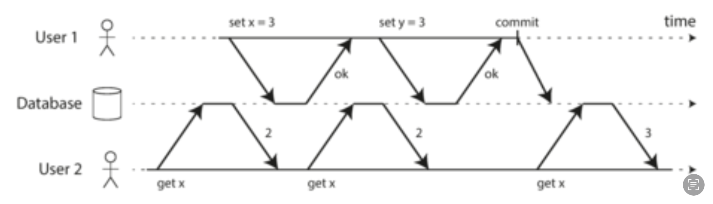
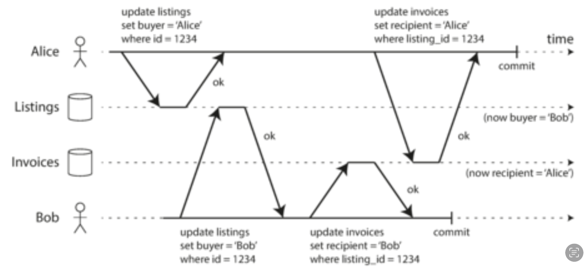
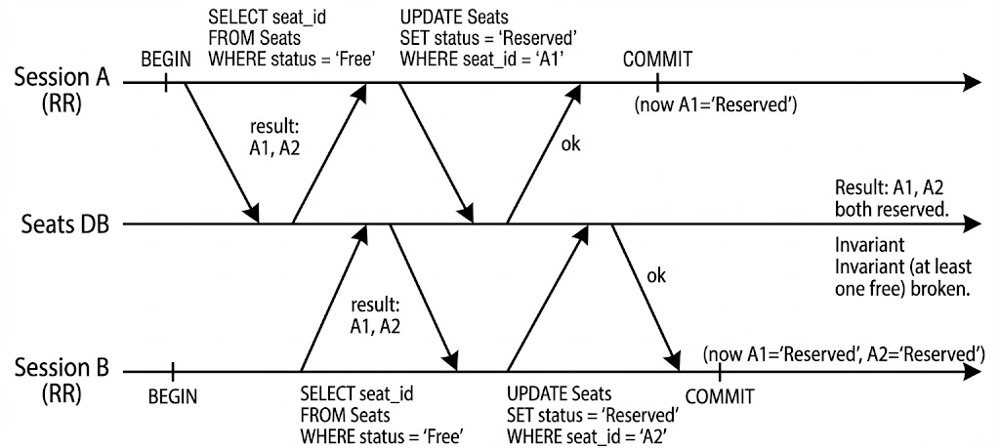

# Isolation Levels Overview

## Objectives

- Explain why different isolation levels exist
- Define isolation anomalies
- Show how each isolation level addresses (or does not address) anamolies
- Choose minimal level for a business invariant

---

## **Key Concepts**

> ***Isolation**  = rules about what a transaction can "see" while others change data*

**Levels (PostgreSQL):**

1. **READ COMMITTED:** each statement sees the latest committed data
2. **REPEATABLE READ:** one snapshot for entire transaction (snapshot isolation)
3. **SERIALIZABLE:** snapshot + conflict detection (abort if unsafe interleaving/ordering)

---

### Scenario: Movie Seat Booking

Two users:

* Session A
* Session A

Show S1 has seats:

* Some house (reserved) seats (kept aside for VIP / guest pass)
  * Policy: at least one house seat must remain free until release)
* Users list available seats, then reserve
* No double booking of the same seat

---

### Data Model

````sql
CREATE DATABASE txn_lab;

\c txn_lab;

CREATE TABLE shows(
  id SERIAL PRIMARY KEY,
  code TEXT UNIQUE
);

CREATE TABLE seats(
  id SERIAL PRIMARY KEY,
  show_id INT REFERENCES shows(id),
  seat_no TEXT,
  house BOOLEAN DEFAULT FALSE,      -- house seat (kept aside)
  reserved BOOLEAN NOT NULL DEFAULT FALSE,
  UNIQUE(show_id, seat_no)
);

- Populate movie and seat details
INSERT INTO shows(code) VALUES ('S1'); -- Kantha evening show
INSERT INTO seats(show_id, seat_no, house)
SELECT 1,'A1',TRUE UNION ALL
SELECT 1,'A2',TRUE UNION ALL
SELECT 1,'A3',FALSE UNION ALL
SELECT 1,'A4',FALSE;
````

---

## Isolation Anomalies

| Anomaly                         | Definition                                                                                  | Example (Session A vs Session B)                                                                  | Prevented By                                                                |
| ------------------------------- | ------------------------------------------------------------------------------------------- | ------------------------------------------------------------------------------------------------- | --------------------------------------------------------------------------- |
| Dirty Read                      | Reading uncommitted changes from another transaction                                        | Session A sees Session B’s tentative reservation before COMMIT                                   | Not possible in PostgreSQL (MVCC)                                           |
| Non-Repeatable Read             | Same row/set read twice within one transaction, value differs                               | Session A lists free seats (A1–A4); after Session B reserves A2, Session A lists again: A1,A3,A4 | REPEATABLE READ / SERIALIZABLE                                              |
| Phantom Read                    | Predicate result changes (rows added/removed matching a filter)                             | Session A counts free house seats (2). Session B reserves A2. Session A counts again: 1           | REPEATABLE READ (snapshot consistency) / SERIALIZABLE                       |
| Lost Update                     | Both read same value, derive new value, one overwrites                                      | Free_count goes 4→3 instead of 4→2                                                              | Use atomic UPDATE or SELECT FOR UPDATE (not fixed by isolation level alone) |
| Write Skew                      | Two transactions read same invariant set, update different rows; together violate invariant | Session A reserves A1; Session B reserves A2; invariant “at least one house seat free” breaks   | SERIALIZABLE (abort + retry) or explicit locking                            |
| Read Skew (Snapshot vs current) | Transaction sees a mix of old and new states across multiple reads                          | Session A sees A2 free early, later uses stale assumption                                         | REPEATABLE READ / SERIALIZABLE mitigate by freezing view                    |

**Note:** Double booking (same seat) prevented by `UNIQUE(show_id, seat_no)` regardless of isolation level.

---

## Snapshot Differences

### **READ COMMITTED** (Non-Repeatable Read)

* When reading from the database, you will only see data that has been committed (no dirty reads)
* When writing to the database, you will only overwrite data that has been committed (no dirty writess)

#### No dirty reads

Imagine a transaction has written some data to the database, but the transaction has not yet committed or aborted.

Can another **transaction see that uncommitted data**? if yes, that is called a dirty read.

**Example:**

User 1 has set x = 3 but user 2's get x still returns the old value 2 while user 1 has not yet committed.



*No dirty reads: user 2 sees the new value for x only after user 1’s transaction has committed.*

#### No dirty writes

What happens if two transactions concurrently try to update the same object in a database?

Later writes overwrites the earlier (assumed). What happens if the earlier write is part of a transaction that has not yet committed, so earlier write overwrites an uncommitted value?

***Overwriting an uncommitted value*** - that is called dirty wrtite.

**Example:**

On a used car website, two people Alice and Bob are simultaneously trying to buy the same car. Buying a car requires two database writes:

* The listing on the website needs to be updated to reflect the buyer
* The sales invoice needs to be sent to the buyer



Note:

* The Sale is awarded to Bob (because he performs the winning (last) update to the listings table)
* The invoice is sent to Alice (because she performs the wining update to the invoice table)

Read committed prevents such mishaps.

**Demo:**

```
Session A                          | Session B
-----------------------------------+-----------------------------
BEGIN                              |
SELECT free seats -> A1,A2,A3,A4   |
                                   | UPDATE A2 reserved=TRUE; COMMIT
SELECT free seats -> A1,A3,A4      |

COMMIT                             |
```

```sql
-- Session A
BEGIN;
SELECT seat_no FROM seats WHERE show_id = 1 AND reserved = FALSE ORDER BY seat_no;

-- wait

-- Session B
UPDATE seats SET reserved = TRUE WHERE show_id = 1 AND seat_no = 'A2';


-- Session A
SELECT seat_no FROM seats WHERE show_id=1 AND reserved=FALSE ORDER BY seat_no;

-- It cannot concurrently overwrite A2 - prevented by READ COMMITTED
-- Read skew exists - A2 is missing now - non-repeatable read.


```

Note: When Session A reads the rows, A2 is missing which was available at the begining of txn - that is called read skew.

Read committed isolation level

* provides abortability
* preventing reading incomplete results of a txn
* prevents concurrents writes from getting intermingled
* read skew is acceptable

---

### REPEATABLE READ (Snapshot Isolation)

**Problem in READ COMMITTED (Read Skew):**

In READ COMMITTED isolation level, each query within a transaction sees the latest committed data at the time of that query. This means *if you read the same data twice within a transaction, you might get **different results** if another transaction commits changes in between*.

**Example:**

Session A begins a transaction and reads available seats, seeing 4 seats (A1, A2, A3, A4). Meanwhile, Session B reserves seat A2 and commits. When Session A reads the available seats again within the same transaction, it now sees only 3 seats (A1, A3, A4). This inconsistency - where the same read returns different results within a single transaction - is called **read skew**.

**Read Skew:**

A transaction ***reads the same data multiple times and gets different results*** because other transactions have committed changes in between the reads.

**Why This is Problematic:**

Session A cannot make reliable decisions based on data that changes mid-transaction. If Session A is performing business logic that depends on a consistent view (e.g., calculating availability, generating reports, or enforcing constraints), read skew can lead to incorrect conclusions and actions.

**How REPEATABLE READ (Snapshot Isolation) Solves This:**

REPEATABLE READ uses snapshot isolation, which ensures that a transaction sees a **consistent snapshot** of the database from the moment it begins. All reads within the transaction see the same state, even if other transactions commit changes. This prevents read skew and allows transactions to reason about data consistently.

```
Session A (RR)                     | Session B
-----------------------------------+-----------------------------
BEGIN ISOLATION LEVEL RR           |
SELECT free seats -> A1,A2,A3,A4   |
                                   | UPDATE A2 reserved=TRUE; COMMIT
SELECT free seats -> A1,A2,A3,A4   | (Session A still sees A2 free)
UPDATE A2 reserved=TRUE (0 rows)   |
COMMIT  
```

**Demo:**

```sql
-- Reset
UPDATE seats SET reserved = FALSE WHERE show_id = 1;

-- Validate
SELECT * FROM seats;

-- Session A
BEGIN ISOLATION LEVEL REPEATABLE READ;
SELECT seat_no FROM seats WHERE reserved = FALSE AND show_id = 1 ORDER BY seat_no;

-- wait

-- Session B
UPDATE seats SET reserved = TRUE WHERE show_id = 1 AND seat_no = 'A2'; COMMIT;

--Session A
SELECT seat_no FROM seats WHERE reserved = FALSE AND show_id = 1 ORDER BY seat_no;


-- UPDATE seats SET reserved = TRUE WHERE show_id = 1 AND seat_no = 'A2';
-- ERROR: could not serialize access due to concurrent update

COMMIT;
-- ROLLBACK

```

To implement snapshot isolation, databases maintain several different committed versions of an object, because various in-progress transactions may need to see the state of database at different points in time. This is technique is known as Multi-Version Concurrency Control (MVCC) - We will discuss this in MVCC module.

---

#### **Preventing Lost Updates**

Lost update problem can occur if an application reads some value from the database, modifies it and writes it back the modified value.

If two transactions do this concurrently, one of the modifications can be lost, because the second write does not include the first modification.

Example Scenario: Free Seat Cunter

Create counter table (materialized free seats):

```sql
CREATE TABLE show_stats(
  show_id INT PRIMARY KEY REFERENCES shows(id),
  free_count INT,
  version INT DEFAULT 0
);

INSERT INTO show_stats(show_id, free_count)
SELECT 1, COUNT(*) FROM seats WHERE show_id=1 AND reserved=FALSE;

```

Initial:

```
SELECT * FROM show_stats; -- free_count = 4
```

Demo:

```
Session A                            | Session B
-------------------------------------+--------------------------------
BEGIN                                | BEGIN
SELECT free_count -> 4               | SELECT free_count -> 4
-- compute new = 3                   | -- compute new = 3
UPDATE show_stats SET free_count=3   | UPDATE show_stats SET free_count=3
COMMIT                               | COMMIT (overwrites Session A's change)
Final free_count = 3 (should be 2)
```

```sql
-- Session A
BEGIN;
SELECT free_count FROM show_stats WHERE show_id=1; -- 4
UPDATE show_stats SET free_count=3 WHERE show_id=1;
-- (Do not commit yet)

-- Session B
BEGIN;
SELECT free_count FROM show_stats WHERE show_id=1; -- still 4 (Session A not committed)
UPDATE show_stats SET free_count=3 WHERE show_id=1;
COMMIT; -- Session B commits first

-- Session A
COMMIT;

SELECT free_count FROM show_stats WHERE show_id=1; -- 3 (lost one decrement)
```

Why isolation levels don’t fix it:

* **REPEATABLE READ** keeps snapshot stable but both still base off “4”.
* **SERIALIZABLE** may allow it if each only writes and doesn’t read updated value after the other commits-no invariant violation unless defined.

**Preventive Approaches**

* **Atomic write operations (cursor stability):**

  Usually implemented by taking an exclusive lock on the object when it is read so that no other txn can read it until the updates has been applied.

  ```sql
  UPDATE show_stats
  SET free_count = free_count - 1
  WHERE show_id=1 AND free_count > 0;
  ```
* **Explicit locking:**

  Explicity lock objects that are going to be updated. Then the application can perform read-modify-write cycle, and if any other transaction tries to concurrently read the same object, it is forced to wait until the first txn has completed.

  ```sql
  BEGIN;
  SELECT free_count FROM show_stats WHERE show_id=1 FOR UPDATE;
  UPDATE show_stats SET free_count = free_count - 1 WHERE show_id=1 AND free_count > 0;
  COMMIT;
  ```
* **Optimistic version check: (Compare and set)**

  Allowing an update to happen only if the value has not changed since you last read it. If the current value does not match what you previously read (version = 0) - the update has no effect.

  ```sql
  BEGIN;
  SELECT free_count, version FROM show_stats WHERE show_id=1;
  -- Suppose free_count=4, version=0
  UPDATE show_stats
  SET free_count = free_count - 1,
      version = version + 1
  WHERE show_id=1 AND version = 0;
  -- Check rows affected = 1 else retry
  COMMIT;
  ```

  If a concurrent transaction already updated (version changed), this update affects 0 rows; client retries with fresh read.

---

#### Write Skew (REPEATABLE READ)

In our Movie Seat booking example, we need to maintain atleast one reserved seat at any one time.

Imagine two VIP users decided to book a seat. They both happen to click the button to book the seat at approximately the same time. What happens next is illustrated below:



This anamoly is called write skew. It is neither a dirty write nor a lost update, because the two transactions are updating two different objects.

Its less obvious that a conflict occured here, but its definetly a race condition: if the txn run one after another, the second user would have been prevented from from booking a reserved seat.

**Demo:**

```plaintext
Session A (RR)                     | Session B (RR)
-----------------------------------+-----------------------------
BEGIN                              | BEGIN
SELECT house free -> A1,A2         | SELECT house free -> A1,A2
UPDATE A1 reserved=TRUE            | UPDATE A2 reserved=TRUE
COMMIT                             | COMMIT
Result: A1,A2 both reserved (invariant broken)
```

```sql
UPDATE seats SET reserved=FALSE WHERE show_id=1;

-- Session A:
 SELECT seat_no FROM seats WHERE house = TRUE and show_id = 1 and reserved = FALSE;


UPDATE seats SET reserved = TRUE WHERE show_id = 1 AND seat_no = 'A1';

-- wait


-- Session B
BEGIN ISOLATION LEVEL REPEATABLE READ;

SELECT seat_no FROM seats WHERE house = TRUE AND show_id = 1 AND reserved = FALSE;


UPDATE seats SET reserved = TRUE WHERE show_id = 1 AND seat_no = 'A2'; COMMIT;

-- Session A
COMMIT;

SELECT seat_no FROM seats WHERE house = TRUE AND show_id = 1 AND reserved = FALSE;

-- Violates the policy

```

---

### Serializable

* Strongest isolation level
* Guarantees that even though txns may execute in parallel, the end result is the same as if they had ***executed one at a time, serially, without any concurrency***
* Prevents all possible race conditions

**Demo:**

```plaintext
Session A (SERIALIZABLE)           | Session B (SERIALIZABLE)
-----------------------------------+-----------------------------
BEGIN                              | BEGIN
SELECT house free -> A1,A2         | SELECT house free -> A1,A2
UPDATE A1 reserved=TRUE            | UPDATE A2 reserved=TRUE
COMMIT (OK)                        | COMMIT → ERROR 40001 (abort)
Retry Session B → sees updated state; invariant preserved
```

```sql
-- Reset

UPDATE seats SET reserved = FALSE WHERE show_id = 1;

-- Session A
BEGIN ISOLATION LEVEL SERIALIZABLE;

SELECT seat_no FROM seats WHERE show_id = 1 AND house = TRUE AND reserved = FALSE;

UPDATE seats SET reserved = TRUE WHERE show_id = 1 AND seat_no = 'A1';


-- Session B
BEGIN ISOLATION LEVEL SERIALIZABLE;
SELECT seat_no FROM seats WHERE show_id = 1 AND house = TRUE AND reserved = FALSE;

UPDATE seats SET reserved = TRUE WHERE show_id = 1 AND seat_no = 'A2';
COMMIT;

-- Session A
COMMIT;
/***
ERROR:  could not serialize access due to read/write dependencies among transactions
DETAIL:  Reason code: Canceled on identification as a pivot, during commit attempt.
HINT:  The transaction might succeed if retried.
***/
```

#### Implementing Serializablity

Most databases that provide serializability today use one of the three techniques:

* Actual Serial Execution
* Two Phase Locking (Pessimistic)
* Serializable Snapshot Isolation (Optimistic)

## Summary

* Lost update requires coordination (atomic, lock, version).
* Write skew prevented by SERIALIZABLE if predicate read occurs.
* Non-repeatable + phantom solved by REPEATABLE READ snapshot.
* SERIALIZABLE adds logical safety (abort cycles).
* Retry on 40001 is normal.

## Reflection

1. What creates lost update? Separate read-modify-write.
2. Why atomic UPDATE solves it? Single evaluation at commit time.
3. Why write skew needs invariant read? To form dependency edges.
4. Why SERIALIZABLE aborts? No valid serial order preserving both decisions.

---

End of Module 2
