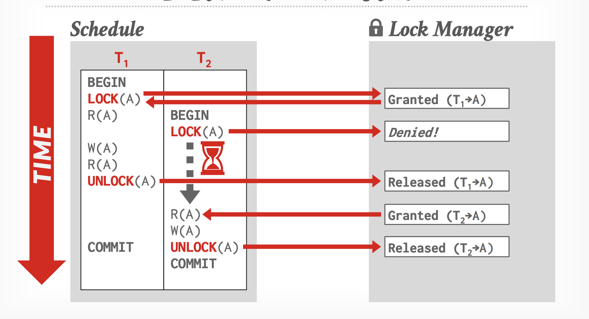
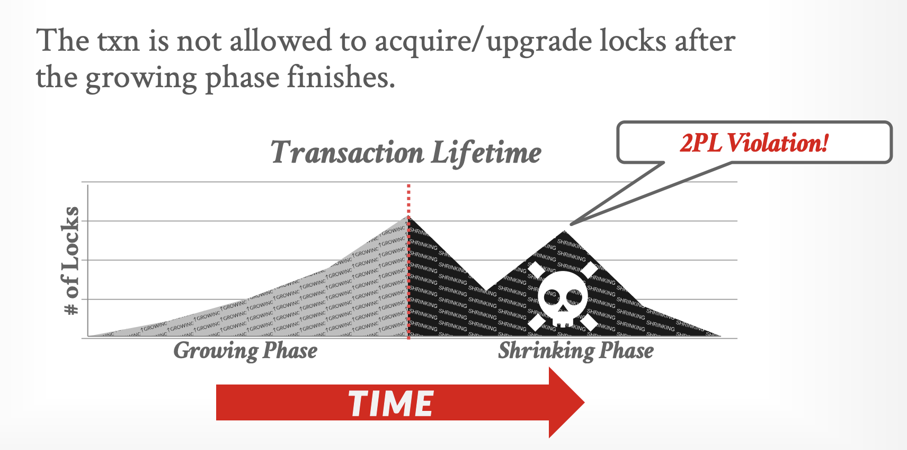
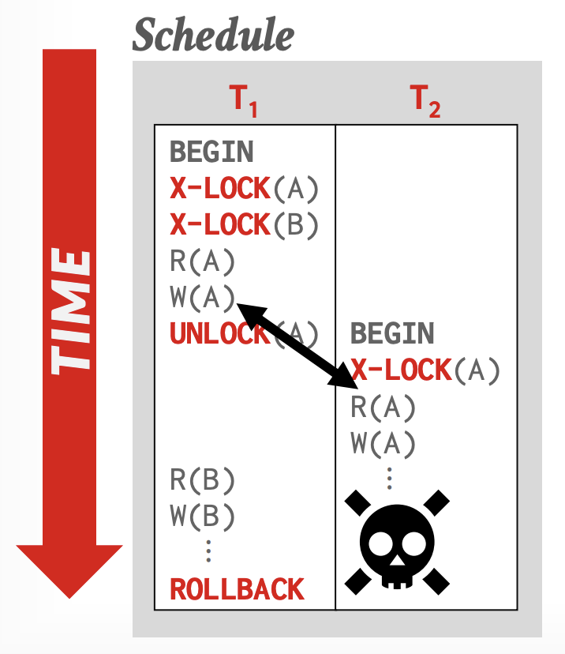

# Module 3 - Two Phase Locking (2PL)

### Ensuring Serializability through Locking Protocols

**Goal:** Build a mental model of how databases use locking rules to guarantee correct transaction ordering, understand the "Growing" and "Shrinking" phases, and recognize the trade-offs like Deadlocks and Cascading Aborts.

---

## 1. Introduction

In Module 1, we learned that a **Serializable Schedule** is the gold standard: it ensures that concurrent transactions produce results as if they ran one after another.

But how does the database actually enforce this? It doesn't run transactions one by one (that would be too slow). Instead, it uses a **Concurrency Control Protocol**.

The most fundamental protocol in database theory is **Two-Phase Locking (2PL)**.

**The Core Rule:**

> *A transaction cannot request a new lock after it has released any lock.*

---

## 2. The System: Inventory Management

To illustrate locking, we will use a simple inventory system where users buy items.

**Setup:**

```sql
CREATE DATABASE locking_lab;
\c locking_lab;

CREATE TABLE inventory (
    id SERIAL PRIMARY KEY,
    product_name TEXT,
    quantity INT,
    reserved INT DEFAULT 0
);

INSERT INTO inventory (product_name, quantity) VALUES 
('Laptop', 10),
('Mouse', 10);
```

---

## 3. Understanding Locks

A database lock is a mechanism used by database management systems (DBMS) to ***manage access to the same data*** by multiple transactions at the same time. It prevents conflicts and ensures data integrity.

Think of it like a **restroom door lock**:

* If someone is inside (holding the lock), others must wait outside until the person leaves (releases the lock).
* This prevents two people from trying to use the same resource at the exact same moment.

### Why do we need locks?

Without locks, concurrent transactions could cause data corruption, such as:

* **Lost Updates:** Two users update the same row, and the last one overwrites the first one without knowing.
* **Dirty Reads:** A user reads data that is being changed by another user but hasn't been saved (committed) yet.

### Common Types of Locks

1.**Shared Lock (Read Lock):**

* Allows multiple transactions to **read** the data at the same time.
* Prevents anyone from **writing** or changing the data until all readers are done.

2.**Exclusive Lock (Write Lock):**

* Allows only **one** transaction to hold the lock.
* Used when a transaction wants to **update** or **delete** data.
* Blocks *everyone else* (both readers and writers) until the lock is released.

### Granularity (What gets locked?)

* **Row Lock:** Locks only a specific row (most common in modern DBs like PostgreSQL). High concurrency.
* **Table Lock:** Locks the entire table. Low concurrency (everyone waits), but faster to manage.
* **Page Lock:** Locks a specific storage page (a block of memory containing multiple rows).

> The DBMS should ideally obtain fewest number of locks that a txn needs.

### Example

In PostgreSQL, an `UPDATE` statement automatically acquires a row-level lock.

**Session A:**

```sql

BEGIN;

-- Acquires an Exclusive Lock on the row where id = 1

UPDATE inventory SET quantity = quantity -1 WHERE id =1;

-- Lock is held until COMMIT or ROLLBACK

```

**Session B:**

```sql

BEGIN;

-- Tries to update the same row

UPDATE inventory SET quantity = quantity -5 WHERE id =1;

-- BLOCKS! Must wait for Session A to finish.

```

---

## 4. Executing with Locks

* Transactions requests locks
* Lock Manager grants or blocks requests
* Transaction release locks
* Lock Manager updates its internal lock-table (keeps tracks of what txn hold what locks and what txn are waiting to acquire any locks)



---

## 5. The Concept: Two Phases

2PL is a concurrency control protocol that determines ***whether a txn can access an object in the database at runtime.***

In 2PL, every transaction goes through two distinct phases based on how it handles locks.

### Phase 1: Growing Phase (Expansion)

* The transaction **acquires** all the locks it needs (Shared or Exclusive).
* The transaction **cannot release** any locks during this phase.
* The number of locks held "grows".

### Phase 2: Shrinking Phase (Contraction)

* The transaction **releases** its locks.
* The transaction **cannot acquire** any new locks.
* Once you release *one* lock, you enter the shrinking phase and can never acquire a lock again.

**Visual Representation:**

```plaintext
       Number of Locks
          ^
          |       ___________ (Point of Maximum Locking)
          |      /           \
          |     /             \
          |    /               \
          |   / (Growing)       \ (Shrinking)
          |  /                   \
          | /                     \
          |__________________________> Time
            Begin               Commit
```



---

## 4. Why 2PL? (The Guarantee)

If all transactions in a system strictly follow the 2PL protocol, the database guarantees  **Conflict Serializability** .

It ensures that the order of conflicting operations is consistent. If Transaction A locks an object before Transaction B, Transaction A effectively comes "before" Transaction B in the history.

---

## 5. Basic 2PL vs. Strict 2PL

There is a theoretical version of 2PL and the practical version used by real databases (like PostgreSQL).

### 5.1 Basic 2PL (Theoretical)

In Basic 2PL, a transaction can release locks *before* it commits, as long as it has finished acquiring all locks.

* **Pros:** Better concurrency (other transactions can access data sooner).
* **Cons:** Suffers from **Cascading Aborts** (see Section 6).

### 5.2 Strict 2PL (Practical / PostgreSQL)

In Strict 2PL, a transaction holds **all exclusive (write) locks** until the transaction ends (Commit or Abort).

* **Rule:** Never release a write lock early.
* **Visual:**

```plaintext
       Number of Locks
          ^
          |       ____________________
          |      /                    |
          |     /                     |
          |    /                      |
          |   /                       |
          |  /                        |
          | /                         |
          |___________________________|__> Time
            Begin                   Commit
                                    (Release All)
```

**PostgreSQL Behavior:** PostgreSQL uses a variation called  **SS2PL (Strong Strict 2PL)** . When you run an `UPDATE`, the lock is held until `COMMIT`.

---

## 6. The Problem: Cascading Aborts

Why do databases prefer Strict 2PL over Basic 2PL? To avoid the "Domino Effect" of rollbacks.



**Scenario (Basic 2PL - Unsafe):**

1. **T1** updates 'Laptop' quantity (Acquires Lock).
2. **T1** releases lock on 'Laptop' (Shrinking phase starts) but  **has not committed yet** .
3. **T2** reads 'Laptop' quantity (Acquires Lock).
4. **T1** crashes and performs a  **ROLLBACK** .

**Result:**
T2 has read "dirty" data that technically never existed (because T1 rolled back).
**T2 must also be rolled back.**
If T3 read from T2, **T3 must also be rolled back.**

**Strict 2PL Solution:**
Because T1 holds the lock until Commit/Rollback, T2 is forced to wait. T2 never sees uncommitted data.

---

## 7. Simulating 2PL in PostgreSQL

Let's see how the "Growing Phase" works in practice using explicit locking.

**Session A (The Transaction):**

```sql

BEGIN;

-- 1. GROWING PHASE STARTS
-- Acquire lock on Row 1 (Laptop)
UPDATE inventory SET quantity = quantity - 1 WHERE id = 1;

-- Still Growing: Acquire lock on Row 2 (Mouse)
UPDATE inventory SET quantity = quantity - 1 WHERE id = 2;

-- We hold locks on both rows now.
-- No other transaction can modify these rows.

-- 2. SHRINKING PHASE (Strict 2PL)
COMMIT; 
-- All locks released simultaneously.

```

---

## 8. The Downside: Deadlocks

2PL guarantees serializability, but it  **does not prevent deadlocks** . In fact, it facilitates them because transactions hold onto locks while waiting for others.

**Scenario:** Two users trying to buy a Laptop and a Mouse, but in different orders.

**Session A:**

```sql

BEGIN;
-- Locks Laptop
UPDATE inventory SET quantity = quantity - 1 WHERE id = 1;

```

**Session B:**

```sql

BEGIN;
-- Locks Mouse
UPDATE inventory SET quantity = quantity - 1 WHERE id = 2;

```

**Session A:**

```sql

-- Tries to lock Mouse -> WAITS for Session B
UPDATE inventory SET quantity = quantity - 1 WHERE id = 2;

```

**Session B:**

```sql

-- Tries to lock Laptop -> WAITS for Session A
UPDATE inventory SET quantity = quantity - 1 WHERE id = 1;

```

**Result:**

PostgreSQL detects the cycle and kills one transaction:
`ERROR:  deadlock detected`

#### Deadlock Handling

When the DBMS detects a deadlock, it will select a ***victim*** txn to rollback to break the cycle.

Victim txn either rollback or abort

> There is a trade-off b/w the frequency of checking for deadlock &
> How long txn wait before deadlocks are broken.

Victim selection depends on...

* By age (lowest timestamp)
* By progress (least / most queries executed)
* By the # of items already locked
* By the # of txns that we have to rollback with it
* By the # of times a txn has been restarted in the past to prevent starvation.

#### Rollback Length

After selecting a victim txn to abort, the DBMS can alco decide on how far to rollback the txn's change.

##### Approach #1: Completely

* Rollback entire txn and tell the application it was aborted

##### Approach #2: Partial (Savepoints)

* Rollback to a portion of a txn (to break deadlock) and then attempt to re-execute the undone queries

---

## 9. Lock Types

To improve performance, 2PL uses different types of locks:

1. **Shared Lock (S):**
   * Used for  **Reading** .
   * Many transactions can hold an S-Lock on the same item.
   * "I am reading this, please don't change it."
2. **Exclusive Lock (X):**
   * Used for **Writing** (Update/Delete).
   * Only one transaction can hold an X-Lock.
   * "I am changing this, nobody else touch it."

**Compatibility Matrix:**

|                         |  Shared (S)  | Exclusive (X) |
| :---------------------- | :-----------: | :-----------: |
| **Shared (S)**    | ✅ Compatible |  ❌ Conflict  |
| **Exclusive (X)** |  ❌ Conflict  |  ❌ Conflict  |

---

## 10. 2PL vs. MVCC (PostgreSQL Context)

It is important to note that PostgreSQL is **not** a pure 2PL system. It is an **MVCC** (Multi-Version Concurrency Control) system.

* **Pure 2PL:** Readers block Writers, and Writers block Readers.
* **PostgreSQL:**
  * **Writers block Writers** (Strict 2PL behavior).
  * **Readers do NOT block Writers** (MVCC behavior).
  * **Writers do NOT block Readers** (MVCC behavior).

This means PostgreSQL uses 2PL logic for  *updates* , but allows *reads* to bypass locks by looking at older versions of the data.

---

## 11. Glossary

* **Growing Phase:** The period where a transaction is acquiring locks.
* **Shrinking Phase:** The period where a transaction is releasing locks.
* **Lock Point:** The moment when a transaction holds the maximum number of locks.
* **Cascading Abort:** When one transaction failing forces others to fail because they read its dirty data.
* **Strict 2PL:** A protocol where write locks are held until the very end of the transaction.
* **Deadlock:** A circular wait condition caused by locking protocols.

---

## 12. Key Takeaways

* **2PL Rule:** Acquire all needed locks, then release. Never acquire after releasing.
* **Serializability:** 2PL guarantees the database remains consistent.
* **Strict 2PL:** Real databases hold locks until `COMMIT` to prevent cascading aborts and ensure easy recovery.
* **Deadlocks:** Are a natural side effect of 2PL. Applications must handle them (retry logic).
* **PostgreSQL:** Uses Strict 2PL for writes, but MVCC for reads to keep performance high.

---

End of Module 3
