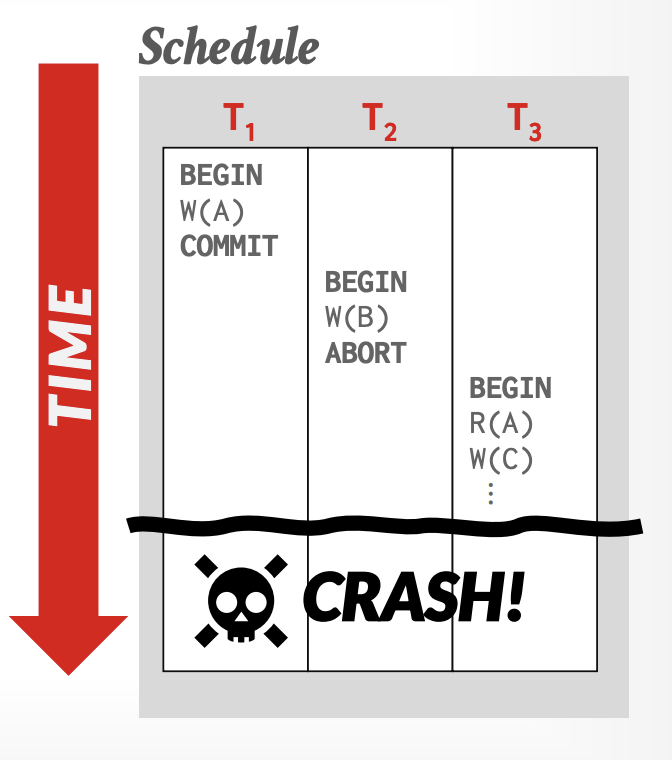
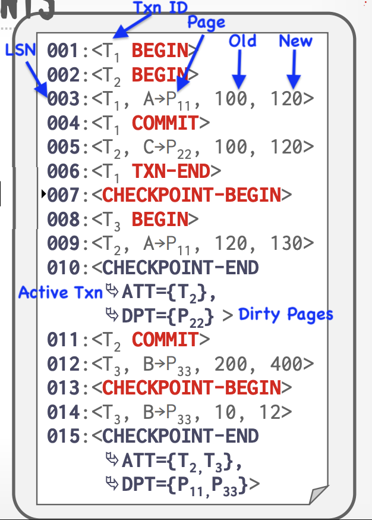
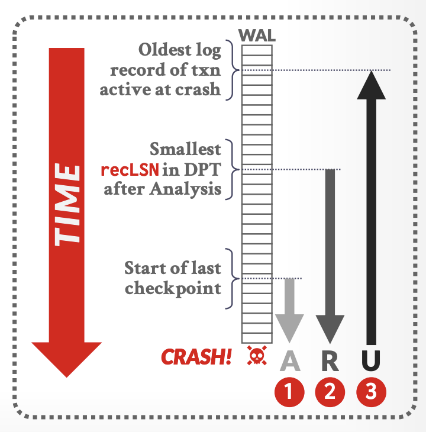
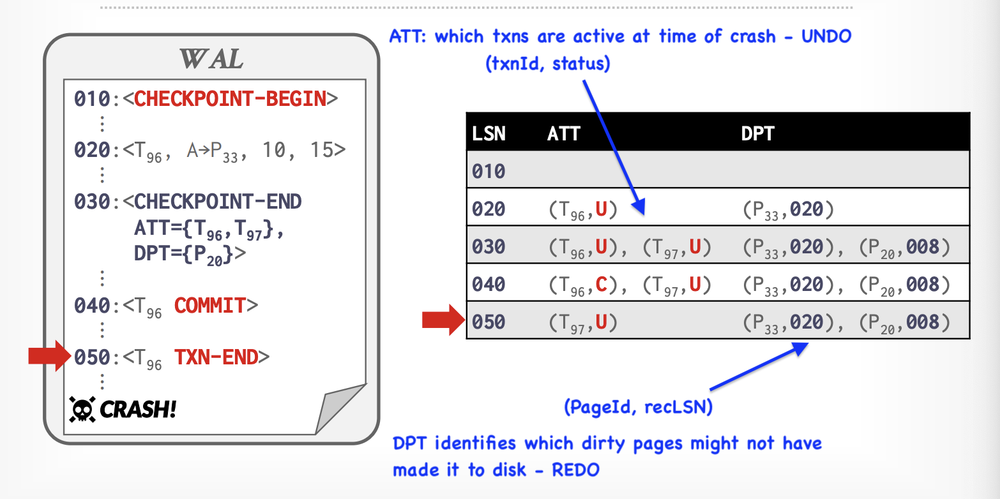

# Module 7 - ARIES Recovery

### Understanding the ARIES Recovery Technique

**Goal:** Learn about the ARIES (Algorithm for Recovery and Isolation Exploiting Semantics) recovery technique, its phases, log structure, and how it effectively manages transactions and crash recovery.

## 1. Introduction

In this module, we will explore the ARIES recovery technique, which is widely used in modern database systems to ensure ***durability and consistency in the face of failures***. ARIES is designed to handle transactions efficiently while providing robust recovery mechanisms.

**The Problem**

When a database system crashes, it is crucial to restore the database to a consistent state. This involves ensuring that all committed transactions are reflected in the database while also rolling back any uncommitted transactions.

**Desired behavior after the DBMS restarts** (i.e., the contents of volatile memory are lost):

* T1 should be durable
* T2 + T3 should be aborted

**The Solution:**

ARIES provides a systematic approach to recovery through its three main phases: Analysis, Redo, and Undo.

## 2. Handling Transactions in ARIES

ARIES effectively manages transactions through its log-based approach. Each transaction is assigned a unique Transaction ID, and its operations are logged sequentially. This allows the system to maintain a clear record of all changes, facilitating recovery in case of a crash.

### Active Transaction Table (ATT)

One entry per currently active txn

* **txnId:** Unique txn identifier
* **status**: The current status mode of the txn
* **lastLSN:** Most recent LSN created by the txn

Remove a txn's ATT entry after appending its the **`TXN-END` **record to the in-memory WAL buffer.

#### Txn Status Codes

* Running -> (R)
* Committing -> (C)
* Candidate for Undo -> (U)

### Dirty Page Table (DPT)

Separate data structure to track which pages in the buffer pool changes that DBMS has nit flushed to disk yet.

**recLSN** -> LSN of the oldest log record that modifed the page since the last time the DBMS wrote the page.

## 3. Log Structure in ARIES

The ARIES recovery technique utilizes a structured log to record all actions performed by transactions. The log entries typically include:

-**Transaction ID:** Unique identifier for each transaction.

-**Operation Type:** Indicates whether the operation is a read, write, commit, or abort.

-**Before Image:** The state of the data before the operation (used for undo).

-**After Image:** The state of the data after the operation (used for redo).

-**Log Sequence Number (LSN):** A unique identifier for each log entry, used to maintain the order of operations.

### Example Log Entry

## 4. The ARIES Recovery Process

* Start from the last BEGIN-CHECKPOINT
* Analysis: Figure out which txns committed or failed since checkpoint
* Redo: Repeat all actions
* Reverse effects of failed txns

### Overview of Phases

#### 1.**Analysis Phase:**

- The system scans the log to identify the state of transactions at the time of the crash.
- It determines which transactions were active, which were committed, and which were uncommitted.
- The analysis phase helps to establish a starting point for the redo and undo operations.

**Example**

#### 2.**Redo Phase:**

- The system re-applies all the changes (including aborted) from the log for committed transactions.
- This phase ensures that all modifications made by committed transactions are reflected in the database.
- The redo operation is performed in the order of the log entries, ensuring that the database is brought up to date.

#### 3.**Undo Phase:**

- The system rolls back changes made by uncommitted transactions.
- It uses the log to identify the changes that need to be undone, ensuring that the database is returned to a consistent state.
- The undo operation is performed in reverse order of the log entries for the uncommitted transactions.

## 5. Key Takeaways

* **ARIES is Robust:** It provides a comprehensive recovery mechanism that ensures durability and consistency.
* **Three Phases:** The analysis, redo, and undo phases work together to restore the database to a consistent state.
* **Log Structure:** The structured log is crucial for tracking transaction operations and facilitating recovery.
* **Transaction Management:** ARIES effectively handles transaction states, ensuring that committed changes are preserved while uncommitted changes are rolled back.

---

End of Module 7
